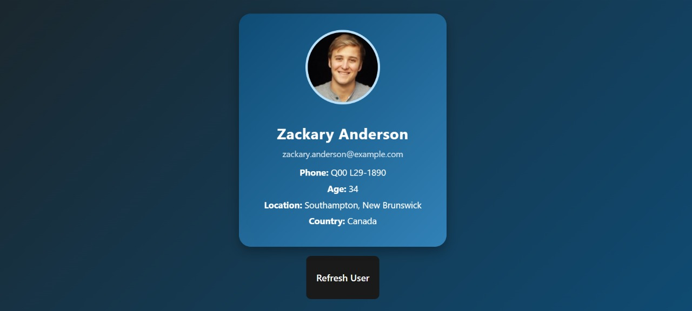
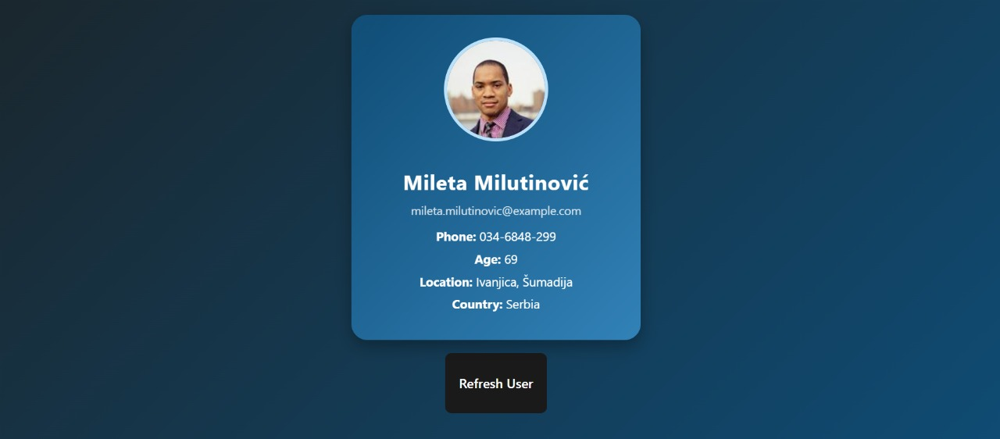

# 🎲 Random User Explorer

🚀 **Tech Stack:** Vite + React.js

🔗 **API Source:** [https://randomuser.me/api/](https://randomuser.me/api/)

> 📄 For a stepwise breakdown of the latest upgrade, see **[Readme_Oct_Updations.md](./Readme_Oct_Updations.md)**.

---

## 💡 **About the Project**

What started as a simple **Random User Generator** (fetch one user, display it) has grown
into a full **Random User Explorer**. It uses the `fetch()` API to pull data from the
**Random User API** and lets you generate, filter, search, favorite, and export user
profiles — all in the browser.

---

## 🎯 **Features**

✅ Fetches data using the `fetch()` method from an external API
✅ **Batch generation** — fetch many users at once and render them in a responsive grid
✅ **API filters** — gender, nationality, result count, and reproducible **seed**
✅ **Live search & sort** — filter by name/email/country, sort by name, age, or country
✅ **Favorites** — star users; saved to `localStorage` and persist across reloads
✅ **Export** — download the current list as **JSON** or **CSV**
✅ **Dark / Light theme** toggle (preference is remembered)
✅ **Robust UX** — loading **skeletons**, error banner with **Retry**, empty states
✅ **Click-to-copy** email and phone, with accessible image `alt` text
✅ Smooth **animations**, modern **UI**, fully **responsive** layout

---

## 🧩 **Project Structure**

```
components/
  api.jsx              # fetch + query-param builder + error handling
  userCard.jsx         # single user card (favorite, copy, a11y)
  UserGrid.jsx         # responsive grid + skeleton loaders
  FilterPanel.jsx      # gender / nat / count / seed / search / sort
  useLocalStorage.jsx  # persistence hook (favorites, theme)
  exportUtils.jsx      # JSON / CSV export helpers
src/
  App.jsx              # Explorer: ties everything together
  App.css              # theme tokens, grid, panel, card styles
```

---

## 🖥️ **Screenshots**

### 🔵 **Initial Load:**



---

### 🟢 **After Clicking Refresh / Generate:**



---

## 🏃 **Getting Started**

```bash
npm install     # install dependencies
npm run dev     # start the dev server
npm run build   # production build
npm run lint    # lint the project
```

---

## ✨ **Why I Built This?**

I created this project to practice working with the **Fetch API** in React and handling
**real-time data**, then extended it to practice real app concerns:

- Managing **component props and state** (and derived state with `useMemo`)
- Building **reusable components** and a **custom hook**
- **Persisting** state with `localStorage`
- Working with **API query parameters** and **error handling**
- Generating **downloadable files** (JSON/CSV) in the browser
- Theming with **CSS variables** and polishing **UX** (skeletons, toasts, retries)

---

## 🚀 **Next Steps / Improvements**

🧭 Add **React Router** for a per-user detail page (map from lat/long)
🧑‍💻 Migrate to **TypeScript** + **TanStack Query** for typed, cached fetching
🧪 Add **Vitest + React Testing Library** tests
🪪 Export individual users as **vCard**
